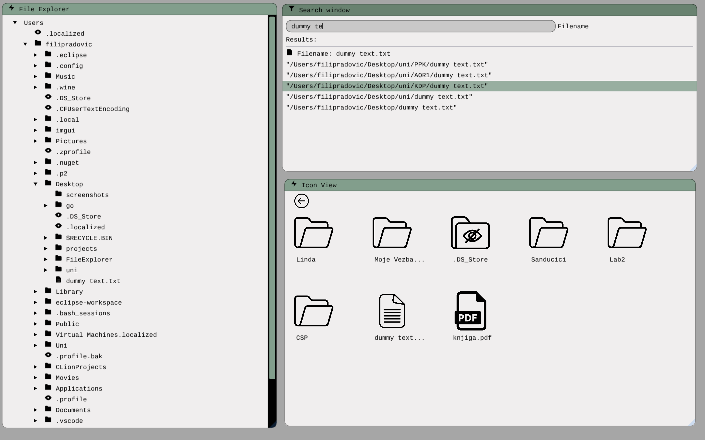
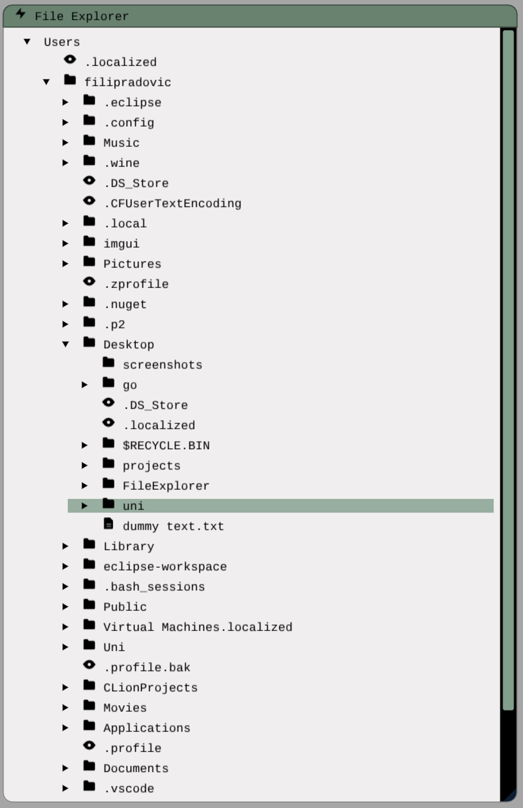
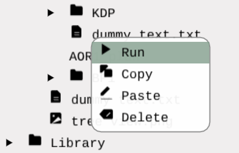
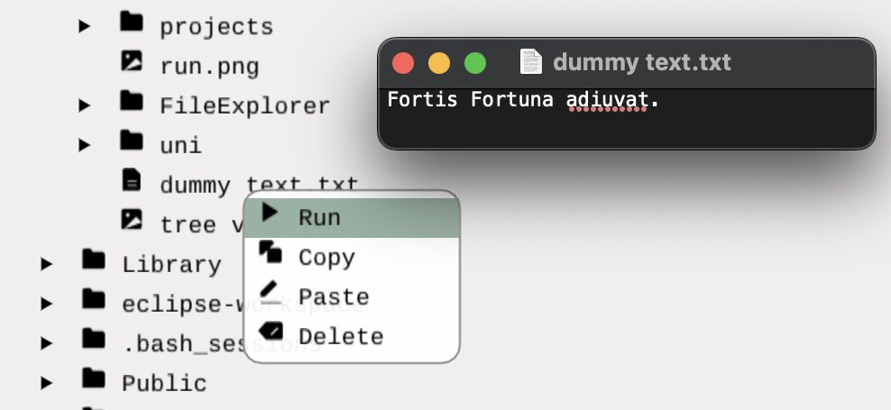
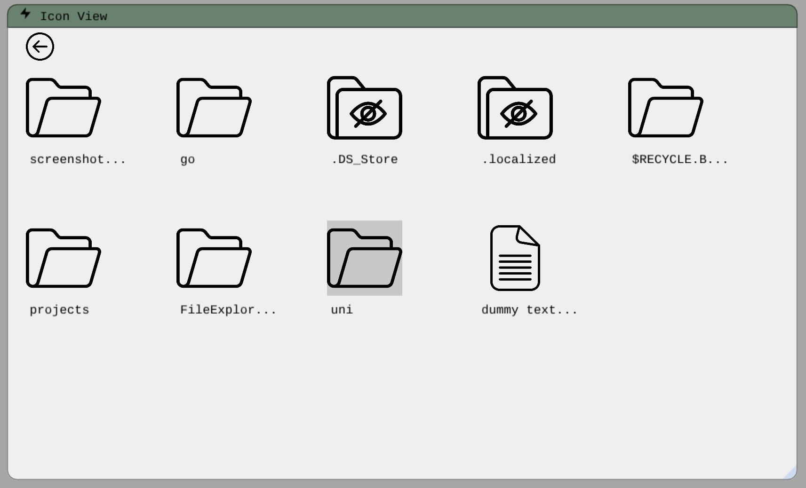
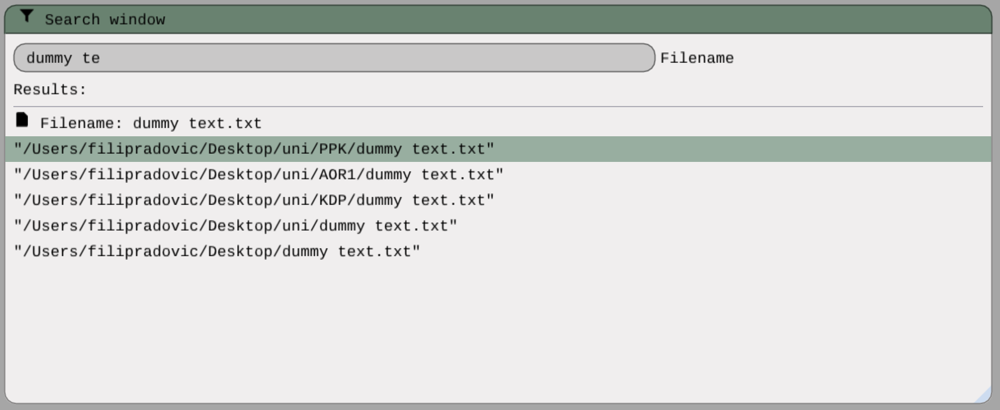

# Cross-Platform File Explorer 

## Description

* Cross-Platform File Explorer app developed using ImGui and OpenGL in C++.
In the current moment app works only on **macOS**, but will soon be available for both Windows and Linux.

## Table of Contents

1. [Features](#features)
2. [Installation](#installation)
3. [Usage](#usage)
4. [Updates](#updates)
5. [License](#license)
6. [Sources](#sources)

## Features

* Tree-view of the filesystem.
* Icon-view of the filesystem.
* Fast filename searching with filesystem caching.
* Basic file manipulation (copy, paste, run/open, delete).

## Installation

### macOS

#### Prerequisites:
Before building the project, ensure you have the following installed:

* **CMake** (version 3.10 or later)
* A **C++ Compiler** supporting C++17
* **GLFW**:

On macOS, you can install GLFW using Homebrew:

``` brew install glfw ```

* **GLEW**:

Install GLEW using Homebrew:

``` brew install glew ```

* **OpenGL**:

macOS provides OpenGL as part of its system libraries, so no additional installation is needed.

* **ImGui**:

The ImGui library is included in the project under the vendor/ImGui directory, so no extra installation is needed for it.

## Usage

### GUI



* GUI consists of three windows:
  1. **Tree View** (leftmost window)
  2. **Icon View** (bottom right window)
  3. **Search window** (top right window)


* The different windows are fully resizable, movable and support simultaneous interaction.

### Tree View GUI

Here is a closer view of the Tree GUI:



* Subdirectories and files of a directory can be viewed by clicking on the directory
icon:


* Right-click on the file icon, the file manipulation window will pop up, then choose
the option that you want. 
* 'Run' option opens the file in the default program.
  * Note: 'Delete' option will be available in some of the future commits.



* Example:



### Icon View GUI

Here is a closer look of Icon GUI:

* To open a folder you left-click on the icon (only one click is needed).




* To go to the parent directory of the current directory, left-click on the 'back arrow':


### Search GUI

* You can search for a file path by typing the file name into the search bar:



* You can run/open the file in the default program by left-clicking on the file path:
  * Note: This feature will be available in some of the future commits.
  


# Updates

### Tree View:
- Implementation for **Delete** option for *Files*.
- *Directory* manipulation (run, delete, copy, paste).

### Icon View:
- Display of the *current path*.
- *Drag and drop* file manipulation.

### Search View:
- *File manipulation* for file path output (run, delete).

### Backend
- **Synchronization** of filesystem *cache state* (needed for searching).
- **Cross-platform** support.

### Style
- **Dark theme.**

# License

* Check out the LICENSE file.

# Sources

* **Icons** used for Icon View window (./textures/icons) are downloaded for free from: https://www.flaticon.com
* **Icon-font** used for Tree View window (./fonts/OpenFontIcons.ttf) is downloaded from this GitHub repo: https://github.com/traverseda/OpenFontIcons

